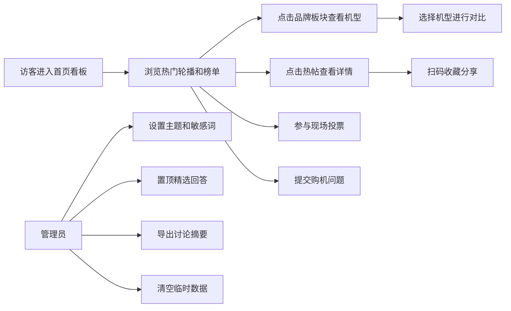

## 1. 产品概述

手机交流论坛纯前端展示系统，专为活动现场或门店大屏设计，用于展示热门手机讨论、品牌对比、用户投票和购机问答。目标受众为到店顾客和活动参与者，旨在增强互动体验、促进产品了解和销售转化。

## 2. 核心功能

### 2.1 用户角色
| 角色 | 说明 | 核心权限 |
|------|------|----------|
| 访客用户 | 现场浏览者，无需登录 | 浏览内容、参与投票、提交问题、查看对比 |
| 管理员 | 活动现场工作人员 | 管理敏感词、切换主题、清空数据、置顶回答、导出摘要 |

### 2.2 功能模块
1. **首页看板**：热门帖轮播、热门讨论榜单、活跃用户、关键词搜索
2. **品牌板块**：按品牌切换展示、新机参数、机型列表
3. **机型对比**：多机型参数对比、价格区间对比、用户评分展示
4. **热帖详情**：帖子内容、精选回答置顶、评论区、收藏分享二维码
5. **投票页**：现场投票发起、实时结果展示、投票统计
6. **提问墙**：用户提交购机问题、问题列表、精选回答置顶
7. **管理员面板**：展示主题设置、敏感词管理、临时数据清空、讨论摘要导出

### 2.3 页面详情
| 页面名称 | 模块名称 | 功能描述 |
|----------|----------|----------|
| 首页看板 | 热门轮播 | 自动轮播展示热门讨论帖，支持手动切换 |
| 首页看板 | 热门榜单 | 按热度排序展示讨论帖列表，支持过滤水帖 |
| 首页看板 | 活跃用户 | 展示发帖和互动最多的用户排行榜 |
| 首页看板 | 搜索栏 | 按关键词搜索帖子标题和内容 |
| 品牌板块 | 品牌导航 | 横向品牌Tab切换，展示各品牌Logo和名称 |
| 品牌板块 | 新机参数 | 展示品牌最新机型的详细规格参数 |
| 品牌板块 | 机型列表 | 展示该品牌所有在售机型卡片 |
| 机型对比 | 机型选择 | 选择2-4款机型进行对比 |
| 机型对比 | 参数对比表 | 并列展示各机型详细参数差异 |
| 机型对比 | 价格区间 | 柱状图对比各机型价格区间 |
| 机型对比 | 用户评分 | 雷达图展示各机型多维评分 |
| 热帖详情 | 帖子正文 | 展示帖子标题、作者、发布时间、正文内容 |
| 热帖详情 | 精选回答 | 置顶展示管理员标记的精选回答 |
| 热帖详情 | 评论列表 | 展示所有用户评论，支持点赞 |
| 热帖详情 | 二维码分享 | 生成帖子收藏/分享二维码 |
| 投票页 | 投票列表 | 展示进行中的投票活动卡片 |
| 投票页 | 投票参与 | 单选/多选投票，提交后展示实时结果 |
| 投票页 | 结果统计 | 饼图/柱状图展示投票比例和票数 |
| 提问墙 | 问题提交 | 表单提交购机相关问题 |
| 提问墙 | 问题展示 | 瀑布流展示所有用户问题 |
| 提问墙 | 精选回答 | 置顶展示已回答的精选问题 |
| 管理员面板 | 主题设置 | 切换亮色/暗色/科技感等展示主题 |
| 管理员面板 | 敏感词管理 | 添加/删除/展示敏感词列表 |
| 管理员面板 | 数据管理 | 清空临时投票、提问、评论等数据 |
| 管理员面板 | 摘要导出 | 导出讨论摘要为文本或JSON文件 |

## 3. 核心流程

## 4. 用户界面设计

### 4.1 设计风格
- **主色调**：科技蓝（#1E40AF）与霓虹青（#06B6D4）渐变，体现数码科技感
- **辅助色**：活力橙（#F97316）作为强调色，用于投票按钮和热门标记
- **背景**：深色主题为主（#0F172A），搭配网格底纹和微光粒子效果
- **按钮风格**：圆角胶囊按钮，带渐变背景和发光悬浮效果
- **字体**：标题使用"Orbitron"科技感字体，正文使用"Noto Sans SC"中文无衬线字体
- **布局风格**：卡片式布局，大尺寸圆角，玻璃拟态（Glassmorphism）效果
- **图标风格**：线性图标，统一2px描边，霓虹发光效果

### 4.2 页面设计概览
| 页面名称 | 模块名称 | UI元素 |
|----------|----------|--------|
| 首页看板 | 热门轮播 | 大尺寸卡片轮播，自动切换动画，指示器带发光效果 |
| 首页看板 | 热门榜单 | 列表卡片，排名序号带渐变背景，热度值显示橙色火焰图标 |
| 首页看板 | 活跃用户 | 圆形头像环，用户昵称滚动展示，徽章等级图标 |
| 品牌板块 | 品牌导航 | 横向滚动Tab，选中项有底部发光指示条 |
| 品牌板块 | 新机参数 | 左侧大图展示，右侧参数网格，关键参数高亮 |
| 机型对比 | 参数对比表 | 固定表头横向滚动，差异项用背景色高亮 |
| 热帖详情 | 精选回答 | 金色边框卡片，置顶徽章，回答者头像放大 |
| 投票页 | 结果统计 | 动态增长柱状图，百分比数字放大显示 |
| 提问墙 | 问题展示 | 多彩便签卡片，错落瀑布流布局 |
| 管理员面板 | 主题切换 | 主题预览小卡片，点击即时切换全局样式 |

### 4.3 响应式
- 大屏优先设计，默认适配1920×1080及以上分辨率
- 支持1280×720到4K的自适应缩放
- 关键信息字号不小于16px，远距离可读
- 触控交互优化，按钮最小尺寸48×48px

### 4.4 动画与动效
- 页面切换：淡入淡出+轻微缩放过渡
- 卡片悬浮：上浮6px + 发光阴影增强
- 数据加载：骨架屏闪烁动画
- 投票结果：柱状图从0动态增长到实际值
- 轮播切换：水平滑动+渐变淡入
