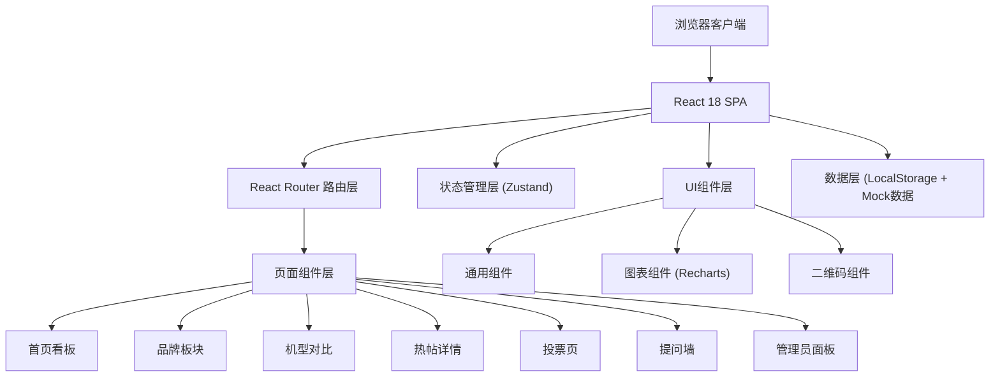
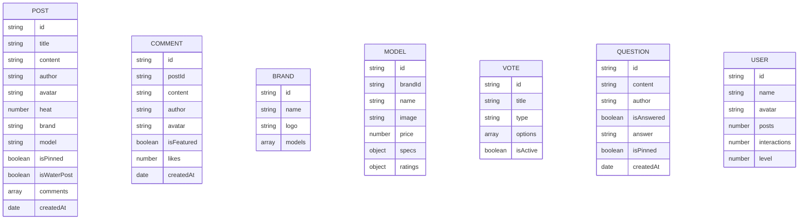

## 1. 架构设计



## 2. 技术说明
- 前端框架: React@18 + TypeScript
- 构建工具: Vite@5
- 路由: react-router-dom@6
- 状态管理: zustand@4
- 样式方案: tailwindcss@3
- UI组件: 自研组件 + lucide-react图标
- 图表库: recharts@2
- 二维码: qrcode.react@3
- 数据持久化: LocalStorage
- 数据来源: 内置Mock数据

## 3. 路由定义

| 路由 | 页面 | 说明 |
|------|------|------|
| / | 首页看板 | 热门轮播、榜单、活跃用户、搜索 |
| /brands | 品牌板块 | 品牌切换、新机参数、机型列表 |
| /compare | 机型对比 | 机型选择、参数对比、图表 |
| /post/:id | 热帖详情 | 帖子内容、评论、二维码 |
| /vote | 投票页 | 投票列表、参与投票、结果展示 |
| /questions | 提问墙 | 问题提交、问题展示、精选回答 |
| /admin | 管理员面板 | 主题、敏感词、数据管理、导出 |

## 4. 数据模型

### 4.1 数据模型定义



### 4.2 Store 状态结构

```typescript
interface AppState {
  posts: Post[];
  brands: Brand[];
  models: Model[];
  votes: Vote[];
  questions: Question[];
  users: User[];
  sensitiveWords: string[];
  theme: 'dark' | 'light' | 'cyber';
  selectedBrand: string | null;
  compareModels: string[];
  searchKeyword: string;
  filterWaterPost: boolean;
}
```
